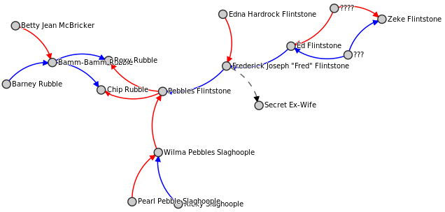
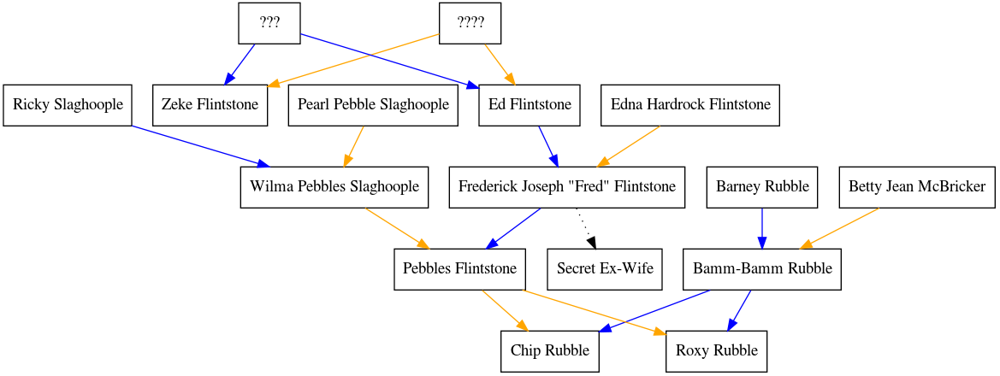

`pedigree` takes a [yaml][] file like that in `examples/example.yaml` ([source][]) and outputs a
few messy visualizations that do not favor patriliny over matriliny.  See `examples/` for example output.

Example:
--------
If you're in a hurry to play,

    pedigree -y examples/example.yaml

Outputs:
--------
  - `.html` file: a [d3][] visualization that can be opened in a web browser
  - `.svg` file: a "Sugiyama style" tree that can be opened in a web browser
  - `.dot` file: the [dot][] file used to generate the `.svg` file

Installation:
-------------
You must first install [graphviz][dot] via

    sudo apt-get install graphviz

Then,

    pip install pedigree

`pedigree --help` will tell you your options.

Caveats:
--------
  - Don't put all your genealogical data in one text file that you manipulate via a python script written by some idiot on the internet.  At least make copies of the one text file.
  - This can only recognize the relations `x is the mother of y`, `x is the father of y`, and `x is the spouse of y`.  It has no concept of siblings or partial siblings.
  - The `.yaml` file depends on every name to be unique, so you may need names like `John Smith (2)` and `John Smith (1)`.

[yaml]: https://en.wikipedia.org/wiki/YAML
[d3]: http://d3js.org/
[dot]: https://en.wikipedia.org/wiki/Graphviz
[source]: https://en.wikipedia.org/wiki/Template:Flintstones_family_tree
